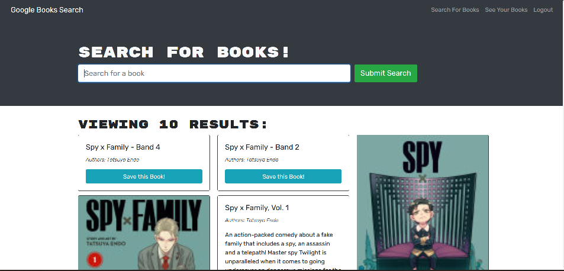

# Book-Search

## Table of Contents

- [Description](#description)
- [Installation](#installation)
- [Initialisaton](#initialisation)
- [License](#license)
- [Media](#media)
- [Contributing](#contributing)
- [Tests](#tests)
- [Questions](#questions)

## Description

This application is an interactive book search which allows you to log in and save your books that you search. It follows the MERN stack, so the technologies include React.js, MonogDB, Express.js, Node.JS. The application also uses MongoDB Atlas and is deployed to Heroku.

Deployed link: https://keyur-book-search.herokuapp.com/

## Installation

Please follow the instructions on how to install the application:

```
Clone the repository
npm install
```

## Initialisation

Please follow the instructions below to run the application:

```
nodemon or npm start
```

## Media

Below is a screenshot of the deployed application after logging in and searching for a book:


## License

This Project is licensed under MIT 

## Contributing

Ways to contribute to the project include:

none

## Tests

Follow the instructions below:

none

## Questions

You can e-mail me at: keyurmist@gmail.com

Visit my GitHub 
